# [📈 Live Status](https://status.omertahaoztop.tr): <!--live status--> **🟩 All systems operational**

This repository contains the open-source uptime monitor and status page for [Ömer Taha Öztop](https://status.omertahaoztop.tr), powered by [Upptime](https://github.com/upptime/upptime).

With [Upptime](https://upptime.js.org), you can get your own unlimited and free uptime monitor and status page, powered entirely by a GitHub repository. We use [Issues](https://github.com/omertahaoztop/upptime/issues) as incident reports, [Actions](https://github.com/omertahaoztop/upptime/actions) as uptime monitors, and [Pages](https://status.omertahaoztop.tr) for the status page.

<!--start: status pages-->
<!-- This summary is generated by Upptime (https://github.com/upptime/upptime) -->
<!-- Do not edit this manually, your changes will be overwritten -->
<!-- prettier-ignore -->
| URL | Status | History | Response Time | Uptime |
| --- | ------ | ------- | ------------- | ------ |
|  [2fauth](https://2fauth.omertahaoztop.tr) | 🟩 Up | [2fauth.yml](https://github.com/omertahaoztop/upptime/commits/HEAD/history/2fauth.yml) | 

 661ms
     
 | 

<a href="https://status.omertahaoztop.tr/history/2fauth">100.00%</a>
    

|  [bazarr](https://bazarr.omertahaoztop.tr) | 🟩 Up | [bazarr.yml](https://github.com/omertahaoztop/upptime/commits/HEAD/history/bazarr.yml) | 

 660ms
     
 | 

<a href="https://status.omertahaoztop.tr/history/bazarr">100.00%</a>
    

|  [changedetection](https://changedetection.omertahaoztop.tr) | 🟩 Up | [changedetection.yml](https://github.com/omertahaoztop/upptime/commits/HEAD/history/changedetection.yml) | 

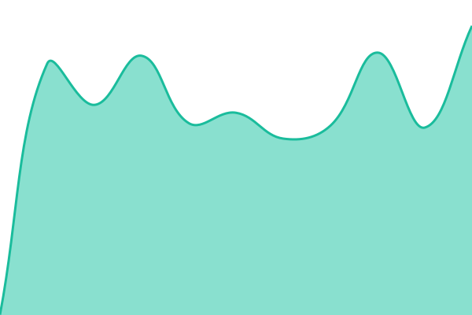 749ms
     
 | 

<a href="https://status.omertahaoztop.tr/history/changedetection">100.00%</a>
    

|  [domain-monitor](https://domain-monitor.omertahaoztop.tr) | 🟩 Up | [domain-monitor.yml](https://github.com/omertahaoztop/upptime/commits/HEAD/history/domain-monitor.yml) | 

 1123ms
     
 | 

<a href="https://status.omertahaoztop.tr/history/domain-monitor">100.00%</a>
    

|  [drift](https://drift.omertahaoztop.tr) | 🟩 Up | [drift.yml](https://github.com/omertahaoztop/upptime/commits/HEAD/history/drift.yml) | 

 1098ms
     
 | 

<a href="https://status.omertahaoztop.tr/history/drift">100.00%</a>
    

|  [flaresolverr](https://flaresolverr.omertahaoztop.tr) | 🟩 Up | [flaresolverr.yml](https://github.com/omertahaoztop/upptime/commits/HEAD/history/flaresolverr.yml) | 

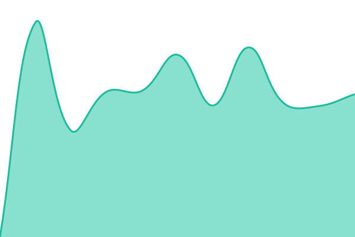 675ms
     
 | 

<a href="https://status.omertahaoztop.tr/history/flaresolverr">100.00%</a>
    

|  [forgejo](https://forgejo.omertahaoztop.tr) | 🟩 Up | [forgejo.yml](https://github.com/omertahaoztop/upptime/commits/HEAD/history/forgejo.yml) | 

 627ms
     
 | 

<a href="https://status.omertahaoztop.tr/history/forgejo">100.00%</a>
    

|  [freshrss](https://freshrss.omertahaoztop.tr) | 🟩 Up | [freshrss.yml](https://github.com/omertahaoztop/upptime/commits/HEAD/history/freshrss.yml) | 

 1118ms
     
 | 

<a href="https://status.omertahaoztop.tr/history/freshrss">100.00%</a>
    

|  [glance](https://glance.omertahaoztop.tr) | 🟩 Up | [glance.yml](https://github.com/omertahaoztop/upptime/commits/HEAD/history/glance.yml) | 

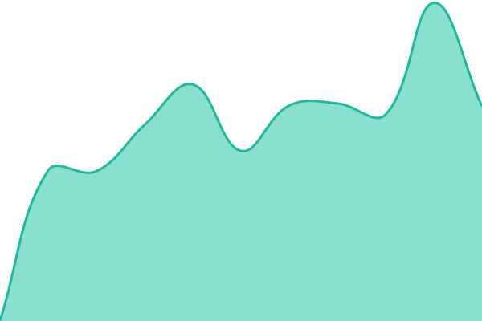 566ms
     
 | 

<a href="https://status.omertahaoztop.tr/history/glance">100.00%</a>
    

|  [gotify](https://gotify.omertahaoztop.tr) | 🟩 Up | [gotify.yml](https://github.com/omertahaoztop/upptime/commits/HEAD/history/gotify.yml) | 

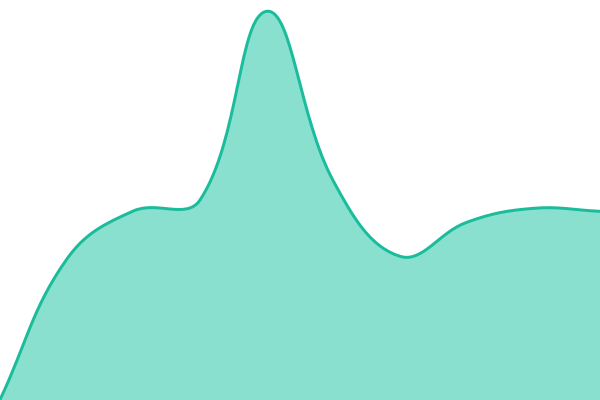 582ms
     
 | 

<a href="https://status.omertahaoztop.tr/history/gotify">100.00%</a>
    

|  [grafana](https://grafana.omertahaoztop.tr) | 🟩 Up | [grafana.yml](https://github.com/omertahaoztop/upptime/commits/HEAD/history/grafana.yml) | 

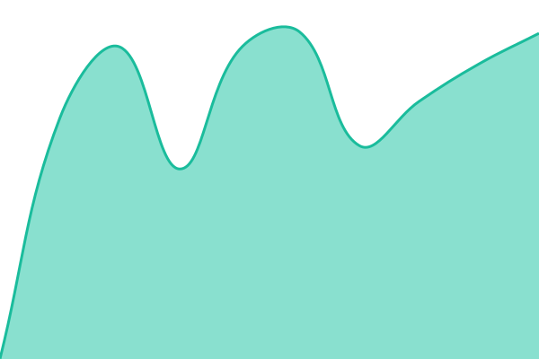 1071ms
     
 | 

<a href="https://status.omertahaoztop.tr/history/grafana">100.00%</a>
    

|  [jellyfin](https://jellyfin.omertahaoztop.tr) | 🟩 Up | [jellyfin.yml](https://github.com/omertahaoztop/upptime/commits/HEAD/history/jellyfin.yml) | 

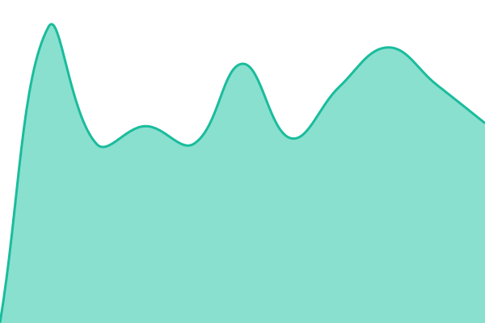 1076ms
     
 | 

<a href="https://status.omertahaoztop.tr/history/jellyfin">100.00%</a>
    

|  [jellyseerr](https://jellyseerr.omertahaoztop.tr) | 🟩 Up | [jellyseerr.yml](https://github.com/omertahaoztop/upptime/commits/HEAD/history/jellyseerr.yml) | 

 1071ms
     
 | 

<a href="https://status.omertahaoztop.tr/history/jellyseerr">100.00%</a>
    

|  [karakeep](https://karakeep.omertahaoztop.tr) | 🟩 Up | [karakeep.yml](https://github.com/omertahaoztop/upptime/commits/HEAD/history/karakeep.yml) | 

 1074ms
     
 | 

<a href="https://status.omertahaoztop.tr/history/karakeep">100.00%</a>
    

|  [kasa](https://kasa.omertahaoztop.tr) | 🟩 Up | [kasa.yml](https://github.com/omertahaoztop/upptime/commits/HEAD/history/kasa.yml) | 

 1035ms
     
 | 

<a href="https://status.omertahaoztop.tr/history/kasa">100.00%</a>
    

|  [komodo](https://komodo.omertahaoztop.tr) | 🟩 Up | [komodo.yml](https://github.com/omertahaoztop/upptime/commits/HEAD/history/komodo.yml) | 

 589ms
     
 | 

<a href="https://status.omertahaoztop.tr/history/komodo">100.00%</a>
    

|  [linkstack](https://linkstack.omertahaoztop.tr) | 🟩 Up | [linkstack.yml](https://github.com/omertahaoztop/upptime/commits/HEAD/history/linkstack.yml) | 

 733ms
     
 | 

<a href="https://status.omertahaoztop.tr/history/linkstack">100.00%</a>
    

|  [myspeed](https://myspeed.omertahaoztop.tr) | 🟩 Up | [myspeed.yml](https://github.com/omertahaoztop/upptime/commits/HEAD/history/myspeed.yml) | 

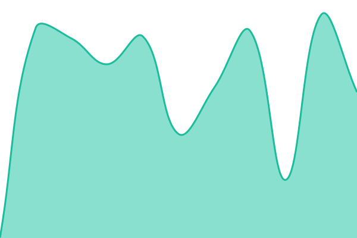 445ms
     
 | 

<a href="https://status.omertahaoztop.tr/history/myspeed">100.00%</a>
    

|  [nzbget](https://nzbget.omertahaoztop.tr) | 🟩 Up | [nzbget.yml](https://github.com/omertahaoztop/upptime/commits/HEAD/history/nzbget.yml) | 

 535ms
     
 | 

<a href="https://status.omertahaoztop.tr/history/nzbget">100.00%</a>
    

|  [omni-tools](https://omni-tools.omertahaoztop.tr) | 🟩 Up | [omni-tools.yml](https://github.com/omertahaoztop/upptime/commits/HEAD/history/omni-tools.yml) | 

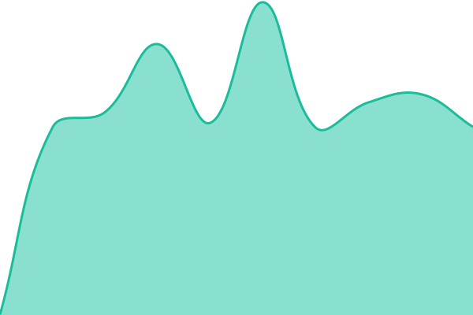 596ms
     
 | 

<a href="https://status.omertahaoztop.tr/history/omni-tools">100.00%</a>
    

|  [pinchflat](https://pinchflat.omertahaoztop.tr) | 🟩 Up | [pinchflat.yml](https://github.com/omertahaoztop/upptime/commits/HEAD/history/pinchflat.yml) | 

 527ms
     
 | 

<a href="https://status.omertahaoztop.tr/history/pinchflat">100.00%</a>
    

|  [prometheus](https://prometheus.omertahaoztop.tr) | 🟩 Up | [prometheus.yml](https://github.com/omertahaoztop/upptime/commits/HEAD/history/prometheus.yml) | 

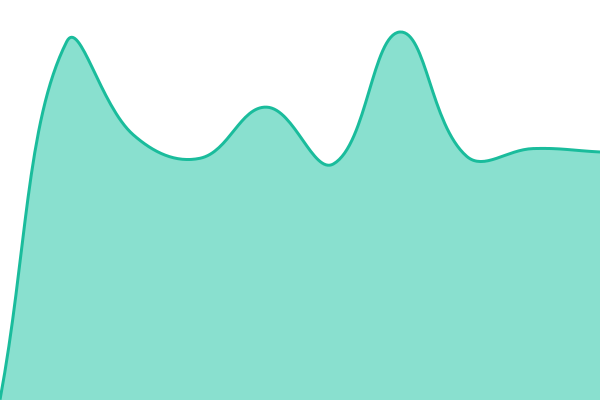 983ms
     
 | 

<a href="https://status.omertahaoztop.tr/history/prometheus">100.00%</a>
    

|  [prowlarr](https://prowlarr.omertahaoztop.tr) | 🟩 Up | [prowlarr.yml](https://github.com/omertahaoztop/upptime/commits/HEAD/history/prowlarr.yml) | 

 984ms
     
 | 

<a href="https://status.omertahaoztop.tr/history/prowlarr">100.00%</a>
    

|  [pulse](https://pulse.omertahaoztop.tr) | 🟩 Up | [pulse.yml](https://github.com/omertahaoztop/upptime/commits/HEAD/history/pulse.yml) | 

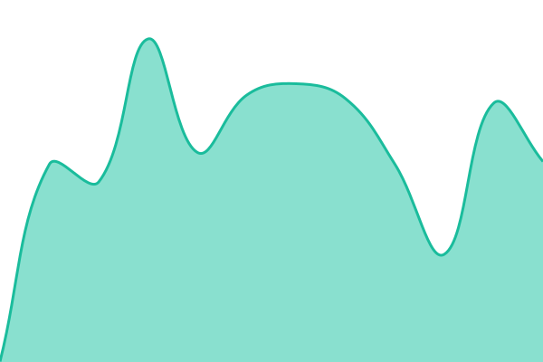 511ms
     
 | 

<a href="https://status.omertahaoztop.tr/history/pulse">100.00%</a>
    

|  [pve-scripts-local](https://pve-scripts-local.omertahaoztop.tr) | 🟩 Up | [pve-scripts-local.yml](https://github.com/omertahaoztop/upptime/commits/HEAD/history/pve-scripts-local.yml) | 

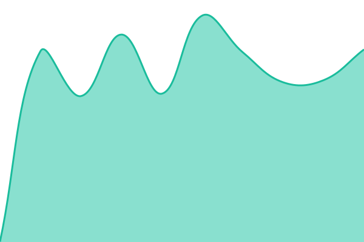 541ms
     
 | 

<a href="https://status.omertahaoztop.tr/history/pve-scripts-local">100.00%</a>
    

|  [qbittorrent](https://qbittorrent.omertahaoztop.tr) | 🟩 Up | [qbittorrent.yml](https://github.com/omertahaoztop/upptime/commits/HEAD/history/qbittorrent.yml) | 

 538ms
     
 | 

<a href="https://status.omertahaoztop.tr/history/qbittorrent">100.00%</a>
    

|  [radarr](https://radarr.omertahaoztop.tr) | 🟩 Up | [radarr.yml](https://github.com/omertahaoztop/upptime/commits/HEAD/history/radarr.yml) | 

 967ms
     
 | 

<a href="https://status.omertahaoztop.tr/history/radarr">100.00%</a>
    

|  [searxng](https://searxng.omertahaoztop.tr) | 🟩 Up | [searxng.yml](https://github.com/omertahaoztop/upptime/commits/HEAD/history/searxng.yml) | 

 567ms
     
 | 

<a href="https://status.omertahaoztop.tr/history/searxng">100.00%</a>
    

|  [semaphore](https://semaphore.omertahaoztop.tr) | 🟩 Up | [semaphore.yml](https://github.com/omertahaoztop/upptime/commits/HEAD/history/semaphore.yml) | 

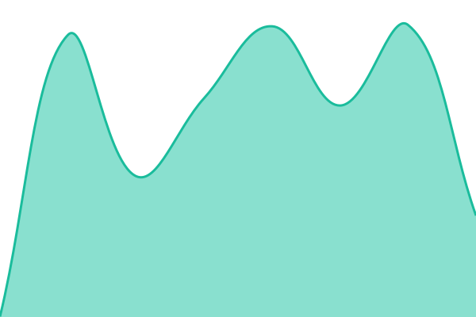 502ms
     
 | 

<a href="https://status.omertahaoztop.tr/history/semaphore">100.00%</a>
    

|  [sonarr](https://sonarr.omertahaoztop.tr) | 🟩 Up | [sonarr.yml](https://github.com/omertahaoztop/upptime/commits/HEAD/history/sonarr.yml) | 

 544ms
     
 | 

<a href="https://status.omertahaoztop.tr/history/sonarr">100.00%</a>
    

|  [termix](https://termix.omertahaoztop.tr) | 🟩 Up | [termix.yml](https://github.com/omertahaoztop/upptime/commits/HEAD/history/termix.yml) | 

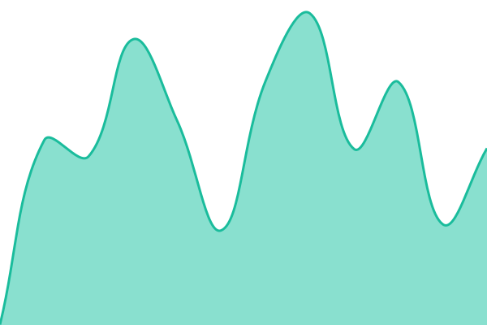 546ms
     
 | 

<a href="https://status.omertahaoztop.tr/history/termix">100.00%</a>
    

|  [triage](https://triage.omertahaoztop.tr) | 🟩 Up | [triage.yml](https://github.com/omertahaoztop/upptime/commits/HEAD/history/triage.yml) | 

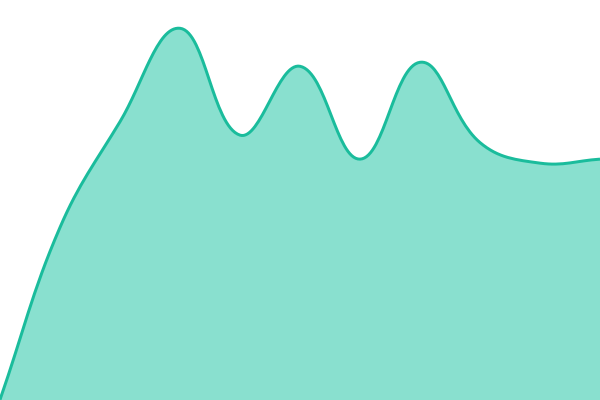 949ms
     
 | 

<a href="https://status.omertahaoztop.tr/history/triage">100.00%</a>
    

|  [triage-test](https://triage-test.omertahaoztop.tr) | 🟩 Up | [triage-test.yml](https://github.com/omertahaoztop/upptime/commits/HEAD/history/triage-test.yml) | 

 1003ms
     
 | 

<a href="https://status.omertahaoztop.tr/history/triage-test">100.00%</a>
    

|  [uptime-home](https://uptime-home.omertahaoztop.tr) | 🟩 Up | [uptime-home.yml](https://github.com/omertahaoztop/upptime/commits/HEAD/history/uptime-home.yml) | 

 1008ms
     
 | 

<a href="https://status.omertahaoztop.tr/history/uptime-home">99.29%</a>
    

|  [vgw](https://vgw.omertahaoztop.tr) | 🟩 Up | [vgw.yml](https://github.com/omertahaoztop/upptime/commits/HEAD/history/vgw.yml) | 

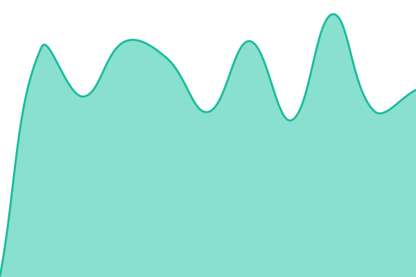 530ms
     
 | 

<a href="https://status.omertahaoztop.tr/history/vgw">100.00%</a>
    

|  [vikunja](https://vikunja.omertahaoztop.tr) | 🟩 Up | [vikunja.yml](https://github.com/omertahaoztop/upptime/commits/HEAD/history/vikunja.yml) | 

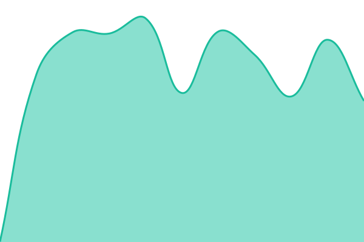 558ms
     
 | 

<a href="https://status.omertahaoztop.tr/history/vikunja">100.00%</a>
    

|  [pbs](https://pbs.omertahaoztop.tr) | 🟩 Up | [pbs.yml](https://github.com/omertahaoztop/upptime/commits/HEAD/history/pbs.yml) | 

 542ms
     
 | 

<a href="https://status.omertahaoztop.tr/history/pbs">100.00%</a>
    

|  [vaultwarden](https://vaultwarden.omertahaoztop.tr) | 🟩 Up | [vaultwarden.yml](https://github.com/omertahaoztop/upptime/commits/HEAD/history/vaultwarden.yml) | 

 585ms
     
 | 

<a href="https://status.omertahaoztop.tr/history/vaultwarden">100.00%</a>
    

|  [librechat](https://librechat.omertahaoztop.tr) | 🟩 Up | [librechat.yml](https://github.com/omertahaoztop/upptime/commits/HEAD/history/librechat.yml) | 

 519ms
     
 | 

<a href="https://status.omertahaoztop.tr/history/librechat">100.00%</a>
    

<!--end: status pages-->

[**Visit our status website →**](https://status.omertahaoztop.tr)

## 📄 License

- Powered by: [Upptime](https://github.com/upptime/upptime)
- Code: [MIT](./LICENSE) © [Anand Chowdhary](https://anandchowdhary.com)
- Data in the `./history` directory: [Open Database License](https://opendatacommons.org/licenses/odbl/1-0/)
